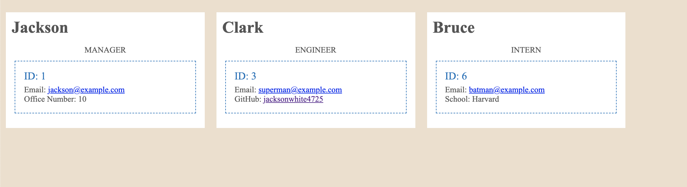

# Team Generator

## Team Generator Description

This Team Generator is meant to keep track of valuable employee data for managerial use in a clear UI. With this tool, manager's and teammates may access emails, GitHub accounts, and much more. This application was built on principles of Test-Driven-Development and used Jest for testing.

## Using application

To use this application, refer to this video: https://watch.screencastify.com/v/tJVleFSP2aKLKd71dyLD

## Installing application

To install this application, either clone this repository or download directly through a zip file. Ensure you're running it on VS-Code. Make sure to use npm to install all necessary packages (inquirer, fs, jest, and path). Start through using the "node index.js" command.
